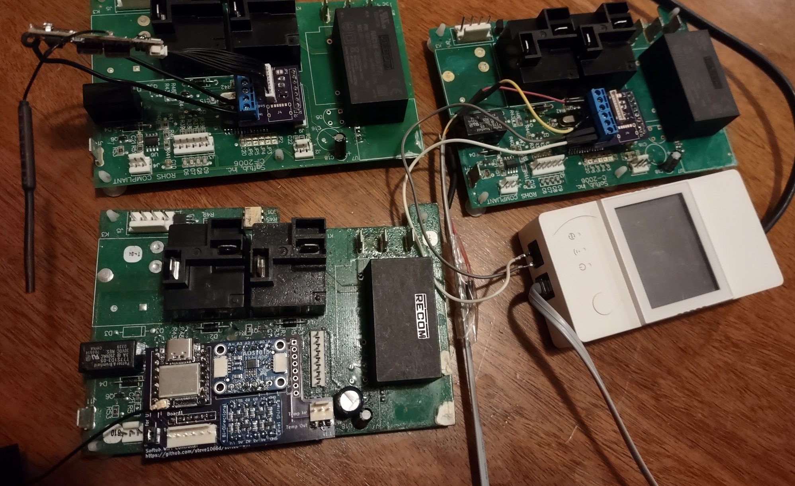

# Options for turning a Softub into a smart tub

There aren’t any plug-and-play solutions available right now, so all approaches require some degree of electrical, electronics, and programming knowledge. This page documents
some possible appraches

### Monitoring the Temperature.
If all you want to do is keep track of the tub’s temperature, then a floating wireless temperature probe is a simple solution:  [https://www.amazon.com/dp/B0C5CC46NZ]. 
It is also the most accurate way of measuring it, since the built-in temperature of the Softub is measuring the water temperature of the 
Hydromate plumbing, which can be quite different than the actual tub temperature.

## Basic Approaches to Controlling
There are a few approaches to controlling the Softub:
1.	Replacing the Controller Board and Control Panel
Use a generic smart home device, such as a Sonoff, to replace the Softub’s existing circuit board and control panel.
2.	Integrating with an upgraded Control Board and Control Panel
Use a device that works alongside the upgraded board.
3.  Completely custom solutions

## 1. Replacing the Controller:
Replacing the Controller Board and Control panel with a Sonoff or other device
What some have done is to use a Sonoff to control the tub instead of the controller and control panel.  It is a is pretty inexpensive way of doing it.  
It requires working with mains voltage to rewire things, and replacing the temperature sensor with one compatible with a Sonoff. 
The app is pretty easy to use as smart home apps go, and it has a simple and straightforward interface.  
If your current board or control panel need fixing or replacing this could be a much cheaper solution.
However, there are things need to be considered:

### Safety:
The Sonoff is only meant to work with a max of ½ hp motor, so there’s a real chance for it to prematurely fail, and do so it a possibly dangerous way. While the
Sonoff is rated for 20 amps, that is for resistive loads.T he stock control board is designed to prevent the hot 
tub from becoming dangerously hot. It has a separate high limit circuit with its own relay that tries to ensure that it never exceeds about 112F no matter 
what part fails.  (though if multiple parts fail it can still malfunction). If a Softub gets stuck in the "on" state, it could reach unsafe temperatures, 
potentially damaging the tub, the Hydromate, or causing scalding injuries. For the Sonoff, you are trusting that single undersized relay to not fail closed.

### Improving the safety of using a Sonoff directly.
Instead of directly controlling the Softub pump, use it to turn on a contactor, such as [this one](https://www.amazon.com/gp/product/B08883NP6D).  
The contactor is a heavy duty relay designed to work with
inductive loads.  You can use two of them in series to ensure that even if one is stuck it won't be stuck on.  (There's some other failure modes that could still
cause runaway temperatures, however, so its not quite as safe as the original board). Also, consider adding an alarm in the Sonoff app if It goes over a certain 
temp.

### Ease of Use
Because the Sonoff replaces the control panel, you have to use the app or some smart device instead of the buttons and display right on the Hydromate. 
You also lose the ability to turn on or off the Softub lights unless you add an additional Sonoff.

## 2. Working with the Upgraded Controller
This requires a board that has been upgraded with the new firmware.  See [this page](https://steve1066d.github.io/devore.tubs/) for detials on the 
improvements and how to get this for your own tub.

### Using a timer or a smart switch
* Since an upgraded board will return to the last temperature set instead of returning to 100F, you could simply plug the Softub into a smart plug or timer.
*  So if the plug turns on the tub would return to the last temp.  This could work well if you only wanted it to run during certain hours of the day, for example.
Using a Sonoff with the updated board. 

### Integrating with the updated board
The updated board can sense on and off requrest from devices that work with "dry" relays such as the [Sonoff Elite](https://www.amazon.com/SONOFF-POWR320D-Monitoring-Universal-Assistant/dp/B09XB3RZB9). 
Like the previous option, you could use this to only run heat during certain hours, but still work normally for other hours.  
Unlike the previous option, if it is configured this way, the control panel stays operational even when the Sonoff is “off”. Also, even if you lose internet, the tub continues to work normally.

### Wi-Fi Adapter board and Smart Device
The upgraded board can send the current temperature to the Sonoff, but it needs to convert the voltage from the 5 volts the Softub uses to the 3.3 volts the Sonoff needs.  
This is done with a small adapter board that also simplifies attaching the smart device. 

### Shelly Uni Plus
A similar solution to the Sonoff is the Shelly Uni Plus.  It is an easier installation because it can be installed in the controller board box, and doesn’t require a separate power source.  However, it is not as user friendly and also can’t integrate the current temperature directly with Alexa.  (It can display in its app though, or if you have Home Assistant, you can use that as a bridge with Alexa). 
Here’s a picture of the Shelly and adapter board plugged into an upgraded controller board.

### Other Options

If you are an electronics hobbyist and interested in doing something custom, see [this page](custom.html) for ideas.

