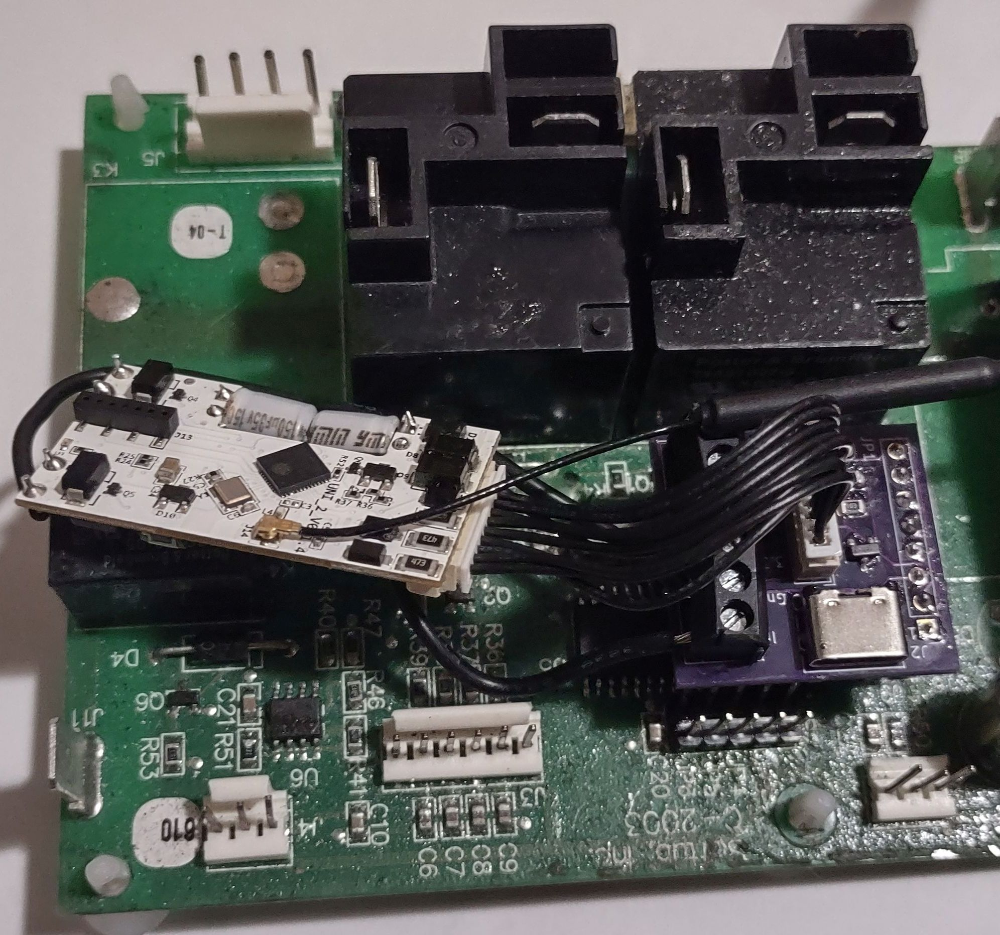

# Wi-Fi Integration

This allows Wi-Fi operation and integration with digital assistants Alexa and 
Google Home and other home automation platforms. The new firmware emulates a
DHT22 temperature and humidity sensor, and monitors a digital input so that
it can be controlled by a home automation device.

Any device that can support a DHT22 sensor and can support controlling a 5v 
circuit can control the Softub.

## Limitations:
Because it is using a third party device, only the current temperature is reported, 
and actions of the smart device is limited to certain defined actions.  See the "Modes" 
seciton below for details.

## Devices
This has been tested with a Sonoff Elite and a Shelly Plus Uni.  There are
advantages and disadvantages of each:

#### Sonoff Elite
The Shelly can't be installed in the Hydromate, so it requires using a waterproof
enclosure, and routing wires through the control box.  However, it is an easier app
to use, and is able to report the temperature to Alexa.

#### Shelly Plus Uni
The Shelly Plus Uni is the simpler installation, because it can be installed
in the control panel box and can tie into the existing control board for power.
However, it doesn't allow the temperature to be reported directly to Alexa or
Google Home, unless Home Assistant or some other MQTT intermediary is used).

Here is a Shelly Uni with the custom adapter board plugged into a Softub board:

While a Sonoff or another device could also directly control a hot tub,
this integration is better because the control panel continues to work, the 
safety features built into the board are not bypassed, and filter and ozone 
calls continue to work normally.  Also, the Sonoff Basic or Elite is only rated
for 1/2 hp or smaller pumps.  (Softub uses a 1.5 HP pump), so twice as big as what is
recommended).  This integration only uses a tiny amount of current, and the 
switching is done using the boards relays.

#### Requirements:
- A board with the updated firmware
- The adapter board
- A compatible Wi-Fi Device

### Installation

See the specific installation for the device you are installing.
If you are installing some other device, use these as a general guide.

- [Shelly Plus Uni](shelly.md)

- [Sonoff Elite](sonoff.md)

After attaching the Wi-Fi device to the adapter board continue with the
following:

Unplug the Hydromate and expose the control board.  If using the Shelly, use 
some tape to surround the Shelly to ensure it doesn't come in contact with 
anything it shouldn't.  Trim or put electrical tape over unused wires.

Attach the adapter board to J9.  Make sure the pins line up. If the board is 
a newer C-2013, you may need to Jumper J2 to provide a ground connection, as the 
ground pin on J9 isn't connected.  See the installation guide for details.

### Configuration
When the power is turned on, the Shelly app will show the tub temperature. 
For controlling the Softub there are 4 options: 

The normal option, called "Default", Shelly will show the current temperature,
and when the app turns on, it is equivalent to pressing the Softub jets button. 
This way, the temperature can be monitored by Shelly, but it is still controlled 
by the tub itself.

The second option, called "Override", will run the tub normally, but if Shelly
indicates that tub should be on, it will override the setting and stay on.  So 
instead of staying on for 20 minutes like normally the jets button does, it will
stay on till Shelly turns off.  To use this mode, set Shelly to turn off after
some time has elapsed. It will however stop if it reaches the maximum 
temperature (104 or whatever has been configured).

The third option, "Heat", is where Shelly should determine the heat
cycles instead of the Shelly. First, set up rules on Shelly to control the start 
and stop temperatures. While the connection is active, Shelly would control the heat 
cycles, subject to the min & max temperatures configured on the board. The 
jets button would still work normally, and you could change the temperature on 
the tub itself, but it would reset the next time Shelly turns from on to off 
(that is when it updates the set temperature). If Shelly stops responding for over
a minute, the firmware will follow the last set point).

The fourth option, "Enable" is where you want to limit the heat and filter
runs to certain hours.  Anytime the Shelly is off it won't run the heat or
filter modes.  However, the jets button still works normally.  Also, if heat 
is called for after the jets button has started it will run to the normal set
point. If you do wish it to not do that, simply press the jets button when you
leave the tub.

The mode can be configured in the service menu, under PP9:

    00: Off
    01: Default
    02: Override
    03: Heat
    04: Enable

In all modes, the tub continues to follow its normal programming, so for example
it will continue to do filter runs, and turn on the Ozone generator, if 
installed and enabled.

### Monitoring the Control Board State
Its possible to return the various status for the control board's outputs to
use in a home automation script. The states of the various outputs can be 
encoded into the humidity value, instead of returning 0.

If this is enabled, and a Wi-Fi device is attached, it will return the sum
of the following values for each output that is on:

    16 Pump
    8 Lights
    4 Ozone
    2 Heat
    1 Filter

For example, if the pump, heat, and lights are on, it will return a humidity of 26. This is enabled by adding 128 to PP6.

### Troubleshooting
Problem: The Wi-Fi device works fine for testing, but it loses connection in the 
Hydromate

Solution:
You may need to add an external antenna, as the metal box might be blocking
the signal.  You could try moving the antenna outside the box facing the router,
or even outside the Hydromate. Here are some possible compatible antennas solutions:
- [Option 1: Antenna](https://www.amazon.com/Antenna-Pigtail-Wireless-Routers-Repeater/dp/B07R21LN5P), 
  [Adapter](https://www.amazon.com/wlaniot-Pigtail-Wireless-Gateway-External/dp/B08ZYK5SL9)
- [Option 2: Antenna](https://www.amazon.com/YOTENKO-Antenna-Omni-Directional-Adapter-Wireless/dp/B0BZGZ1FW8/)

Another option is to move your router or add another wireless access point closer
to the Softub.

### Technical details

The adapter board is a small board PCB that plugs into J9, and has some screw
terminals to connect to the Wi-Fi device. It also has a socket to connect the Shelly 
directly.

The programming header has access to pins 1, 27, and 28.  Since 28 is the same 
as JP2 and is used to indicate Celsius, it uses pins 1 and 27.
Pin 1 is used to connect the dry relay, so that it is known when heat is 
requested.  Pin 27 is used to emulate a digital DHT22 sensor. It should match 
whatever is displayed for the current temperature on the console (within .1 
degree F).  Pin 28 is tied to ground, so that C-2013 boards without ground
can work if J2 is jumpered.

The adapter board also converts the 3.3v logic of the Shelly or Sonoff to the 
5v logic of the Softub. The board will work with any device that runs between
3 and 5 volts.

